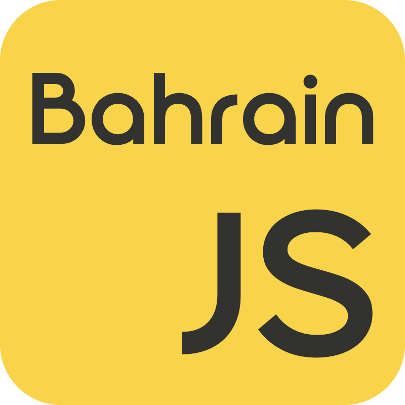

  
   
   

<h1>Awesome Bahrain </h1>

  
A curated list of awesome projects, resources, and communities in the Kingdom of Bahrain.

## Contents

- [Open Source Projects](#open-source-projects)
- [Developer Communities](#developer-communities)
- [APIs and Data](#apis-and-data)
- [Startups and Tech Companies](#startups-and-tech-companies)
- [Fintech](#fintech)
- [Incubators and Accelerators](#incubators-and-accelerators)
- [Education](#education)
- [Government and Civic Tech](#government-and-civic-tech)
- [Infrastructure](#infrastructure)
- [Events and Meetups](#events-and-meetups)
- [Media and Content](#media-and-content)

## Open Source Projects

- [mapbh](https://github.com/ahmed-machine/mapbh) - Visualizing Bahrain with historical maps using Leaflet and ClojureScript.
- [pray.bh](https://github.com/yazinsai/pray.bh) - Prayer times for Bahrain built with TypeScript.
- [bahrain-geojson](https://github.com/akalati/bahrain-geojson) - GeoJSON geometry files for Bahrain regions and boundaries.
- [bh-cv-api](https://github.com/plusmnt/bh-cv-api) - Coronavirus statistics API from the Bahrain Ministry of Health.
- [bahrain-banks](https://github.com/amal-ai/bahrain-banks) - Compare cashback rates for credit cards in Bahrain.
- [ha-clock-bh](https://github.com/iret33/ha-clock-bh) - Home Assistant integration for clock.bh with timezone support.
- [Colouring Bahrain](https://github.com/colouring-cities/colouring-bahrain) - Citizen science project collecting data on every building in Bahrain.
- [ArabWatch](https://github.com/SiteQ8/ArabWatch) - Comprehensive Arabic monitoring dashboard with live news and data.

## Developer Communities

- [Bahrain.js](https://bahrain.js.org) - JavaScript and web development community in Bahrain.
- [GDG Manama](https://gdg.community.dev/gdg-manama/) - Google Developer Group for Bahrain.
- [SEI Bahrain](https://github.com/orgs/SEI-08-Bahrain/repositories) - General Assembly Software Engineering Immersive cohort projects.
- [Women Techmakers Bahrain](https://www.womentechmakers.com) - Community empowering women in technology through events and mentorship.

## APIs and Data

- [bahrain-tech-resource](https://github.com/plusmnt/bahrain-tech-resource) - List of online services available for developers in Bahrain including payment, shipping, and data.
- [MENA GeoJSON](https://github.com/wjdanalharthi/MENA_GeoJSON) - GeoJSON boundaries for MENA countries and their regions including Bahrain.
- [bank-domains](https://github.com/karenyousefi/bank-domains) - Lists of bank domains for GCC countries including Bahrain.
- [Bahrain Open Data Portal](https://www.data.gov.bh) - Official government open data portal with hundreds of datasets in CSV, JSON, and XML.

## Startups and Tech Companies

- [Array Innovation](https://github.com/arrayinnovation) - Bahrain tech company contributing to open source projects including Grafana, Vitest, and Prettier.
- [Calo](https://calo.app) - Healthy meal subscription service powered by technology.
- [CTM360](https://ctm360.com) - Cybersecurity platform for external attack surface management and digital risk protection.
- [Skiplino](https://www.skiplino.com) - Queue management and appointment booking platform.
- [Faceki](https://faceki.com) - AI-powered biometric authentication and digital KYC platform.
- [Worth AI](https://worthai.com) - AI-powered inclusive financial underwriting and credit risk assessment.

## Fintech

- [Central Bank of Bahrain Sandbox](https://www.cbb.gov.bh/fintech/) - Regulatory sandbox for fintech innovation in Bahrain.
- [Bahrain FinTech Bay](https://www.bahrainfintechbay.com) - Fintech hub and accelerator in the Kingdom of Bahrain.
- [Benefit](https://www.benefit.bh) - National electronic payment services provider.
- [Rain](https://rain.bh) - Licensed cryptocurrency exchange regulated by the Central Bank of Bahrain.
- [CoinMENA](https://coinmena.com) - Regulated digital asset trading platform for the GCC region.
- [Tarabut Gateway](https://tarabutgateway.com) - Open banking platform regulated by the Central Bank of Bahrain.
- [SADAD](https://sadadbahrain.com) - Electronic payment channel provider for kiosks, online gateways, and mobile.
- [EazyPay](https://eazy.bh) - Point-of-sale and e-payment gateway services across the region.
- [Flooss](https://flooss.com) - Sharia-compliant digital instant financing and Buy Now Pay Later platform.
- [Aion Digital](https://aiondigital.com) - API-powered digital banking platform enabling banks to go digital.

## Incubators and Accelerators

- [Flat6Labs Bahrain](https://flat6labs.com/location/bahrain/) - Seed funding and accelerator program for tech startups.
- [Brinc Batelco IoT Hub](https://www.brinc.io) - Accelerator focused on IoT, AI, and hardware with prototyping labs.
- [Hope Ventures](https://hopefund.bh) - Investment arm of the Hope Fund with a coworking space in Seef.
- [Tenmou](https://tenmou.me) - Angel investor network and startup support community.
- [EDB Bahrain](https://www.bahrainedb.com) - Economic Development Board promoting business and investment in Bahrain.

## Education

- [University of Bahrain CIC](https://github.com/orgs/bahrain-uob/repositories) - Cloud Innovation Center program with open source student projects.
- [Bahrain Polytechnic](https://github.com/bahrain-bp) - Government tertiary education institute with public student projects on GitHub.
- [RCSI Bahrain](https://www.rcsi.com/bahrain) - Royal College of Surgeons in Ireland, Bahrain campus.
- [American University of Bahrain](https://www.aubh.edu.bh) - Private university offering technology and engineering programs.

## Government and Civic Tech

- [bahrain.bh](https://www.bahrain.bh) - Unified national portal providing access to over 900 government eServices.
- [IGA Bahrain](https://github.com/IGA-BH) - Information and eGovernment Authority with public repositories.
- [Tamkeen](https://tamkeen.bh) - Government entity supporting business growth, enterprise development, and workforce training in Bahrain.
- [Tawasul](https://www.bahrain.bh/tawasul) - National suggestions and complaints system for government services.
- [NSSA](https://nssa.gov.bh) - National Space Science Agency advancing space research and satellite development.

## Infrastructure

- [AWS Middle East (Bahrain) Region](https://aws.amazon.com/local/bahrain/) - Amazon Web Services cloud infrastructure region based in Bahrain.

## Events and Meetups

- [Bahrain.js Meetups](https://github.com/user/bahrain.js) - Regular JavaScript and web development meetups in Manama.
- [Startup Bahrain](https://startupbahrain.com) - National platform connecting founders with resources, events, and community in Bahrain.

## Media and Content

- [Radio Bahrain Podcasts](https://github.com/RadioBahrain/podcasts-distro) - Podcast distribution platform for إذاعة البحرين.

## Contributing

Contributions welcome! Read the [contribution guidelines](contributing.md) first.

## Footnotes

This list is maintained by the [Bahrain.js](https://github.com/bahrain-js) community. Data on active developers sourced from [committers.top](https://committers.top/bahrain.html) and [top-github-users](https://github.com/gayanvoice/top-github-users/blob/main/markdown/public_contributions/bahrain.md).
